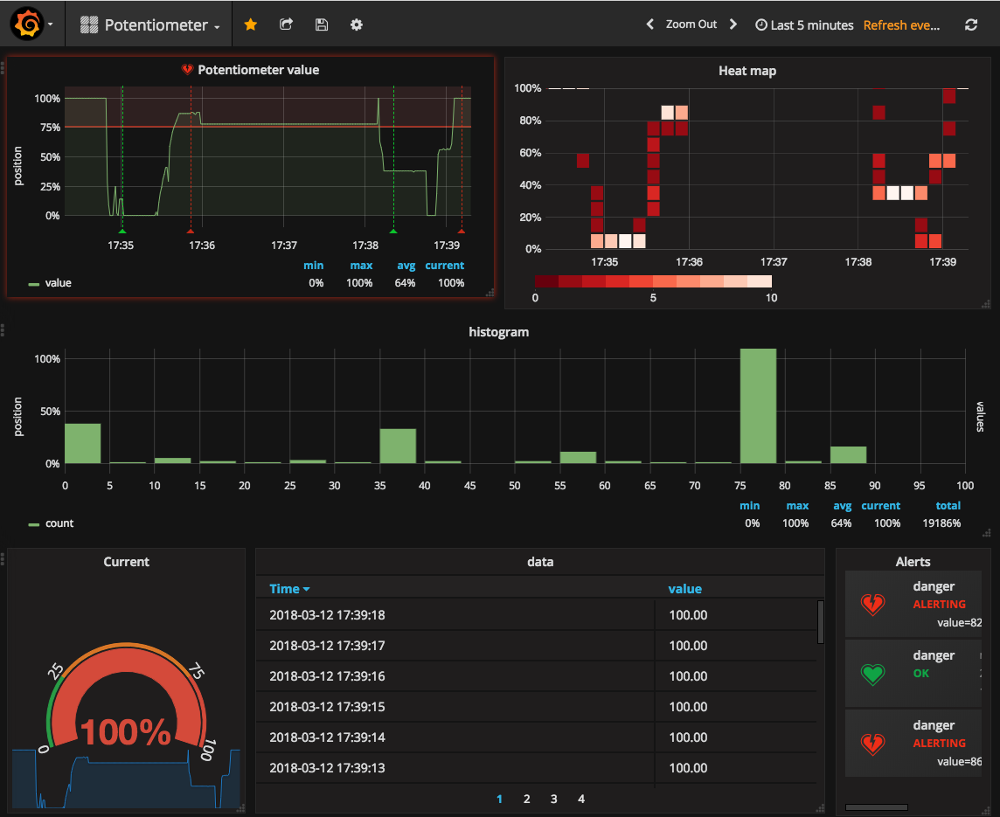
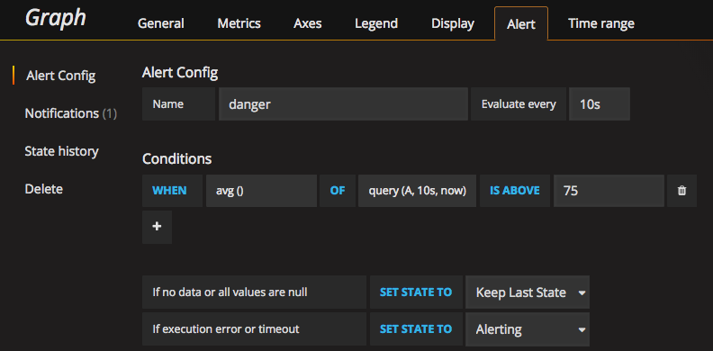

## Playing with Docker, MQTT, Grafana, InfluxDB, Python and Arduino

I must admit this post is just an excuse to play with Grafana and InfluxDb. InfluxDB is a cool database especially designed to work with time series. And Grafana is one open source tool for time series analytics. I want to build a simple prototype. The idea is:

* One Arduino device (esp32) emits a MQTT event to a mosquito server. I'll use a potentiometer to emulate one sensor (Imagine for example a temperature sensor instead of potentiometer)
* One Python script will be listening to the MQTT event in my Raspberry Pi and it will persist the value to InfluxDB
* I will monitor the state of the time series given by the potentiometer with Grafana
* I will create an alert in Grafana (for example when the average value within 10 seconds is above a threshold) and I will trigger a webhook when the alert changes its state
* One microservice (a Python flash server) will be listening to the webhook and it will emit a MQTT event depending on the state
* Another Arduino device (one nodemcu) will be listening to this MQTT event and it will activate a led. Red one if the alert is on and green one if the alert is red

### Server
As I said before we'll need three servers:
* MQTT server (mosquitto)
* InfluxDB server
* Grafana server

We'll use Docker. I've got a Docker host running in a Raspberry Pi3. The Raspberry Pi is a ARM device so we need docker images for this architecture.

```yml
version: '2'

services:
  mosquitto:
    image: pascaldevink/rpi-mosquitto
    container_name: moquitto
    ports:
     - "9001:9001"
     - "1883:1883"
    restart: always
  
  influxdb:
    image: hypriot/rpi-influxdb
    container_name: influxdb
    restart: always
    environment:
     - INFLUXDB_INIT_PWD="password"
     - PRE_CREATE_DB="iot"
    ports:
     - "8083:8083"
     - "8086:8086"
    volumes:
     - ~/docker/rpi-influxdb/data:/data

  grafana:
    image: fg2it/grafana-armhf:v4.6.3
    container_name: grafana
    restart: always
    ports:
     - "3000:3000"
    volumes:
      - grafana-db:/var/lib/grafana
      - grafana-log:/var/log/grafana
      - grafana-conf:/etc/grafana

volumes:
  grafana-db:
    driver: local  
  grafana-log:
    driver: local
  grafana-conf:
    driver: local
```

### ESP32
The Esp32 part is very simple. We only need to connect our potentiometer to the Esp32. The potentiometer has three pins: Gnd, Signal and Vcc. We'll use the pin 32.
We only need to configure our Wifi network and connect to our MQTT server.

```c
#include <PubSubClient.h>
#include <WiFi.h>

const int potentiometerPin = 32;

// Wifi configuration
const char* ssid = "my_wifi_ssid";
const char* password = "my_wifi_password";

// MQTT configuration
const char* server = "192.168.1.111";
const char* topic = "/pot";
const char* clientName = "com.gonzalo123.esp32";

String payload;

WiFiClient wifiClient;
PubSubClient client(wifiClient);

void wifiConnect() {
  Serial.println();
  Serial.print("Connecting to ");
  Serial.println(ssid);

  WiFi.begin(ssid, password);

  while (WiFi.status() != WL_CONNECTED) {
    delay(500);
    Serial.print(".");
  }
  Serial.println("");
  Serial.print("WiFi connected.");
  Serial.print("IP address: ");
  Serial.println(WiFi.localIP());
}

void mqttReConnect() {
  while (!client.connected()) {
    Serial.print("Attempting MQTT connection...");
    if (client.connect(clientName)) {
      Serial.println("connected");
    } else {
      Serial.print("failed, rc=");
      Serial.print(client.state());
      Serial.println(" try again in 5 seconds");
      delay(5000);
    }
  }
}

void mqttEmit(String topic, String value)
{
  client.publish((char*) topic.c_str(), (char*) value.c_str());
}

void setup() {
  Serial.begin(115200);

  wifiConnect();
  client.setServer(server, 1883);
  delay(1500);
}

void loop() {
  if (!client.connected()) {
    mqttReConnect();
  }
  int current = (int) ((analogRead(potentiometerPin) * 100) / 4095);
  mqttEmit(topic, (String) current);
  delay(500);
}
```  

### Mqtt listener

The esp32 emits an event ("/pot") with the value of the potentiometer. So we're going to create a MQTT listener that listen to mqtt and persits the value to InfluxDB
```python
import paho.mqtt.client as mqtt
from influxdb import InfluxDBClient
import datetime
import logging


def persists(msg):
    current_time = datetime.datetime.utcnow().isoformat()
    json_body = [
        {
            "measurement": "pot",
            "tags": {},
            "time": current_time,
            "fields": {
                "value": int(msg.payload)
            }
        }
    ]
    logging.info(json_body)
    influx_client.write_points(json_body)


logging.basicConfig(level=logging.INFO)
influx_client = InfluxDBClient('docker', 8086, database='iot')
client = mqtt.Client()

client.on_connect = lambda self, mosq, obj, rc: self.subscribe("/pot")
client.on_message = lambda client, userdata, msg: persists(msg)

client.connect("docker", 1883, 60)

client.loop_forever()
```

### Grafana
In grafana we need to do two things. First create one datasource from our InfluxDB server. It's pretty straightforward to it.
Finally we'll create a dashboard. We only have one time-serie with the value of the potentiometer. I must admit that my dasboard has a lot things that I've created only for fun.
Thats the query that I'm using to plot the main graph
```
SELECT last("value") FROM "pot" WHERE time >= now() - 5m GROUP BY time(1s) fill(previous)
```
Here we can see the dashboard


And here my alert configuration:



I've also created a notification channel with a webhook. Grafana will use this web hook to notify when the state of alert changes

### Webhook listener
Grafana will emit a webhook, so we'll need an REST endpoint to collect the webhook calls. I normally use PHP/Lumen to create REST servers but in this project I'll use Python and Flask.
We need to handle HTTP Basic Auth and emmit a MQTT event. Mqtt is a very simple protocol but it has one very nice feature that fits like hat fits like a glove here. Le me explain it:
Imagine that we've got our system up and running and the state is "ok". Now we connect one device (for example one big red/green lights). Since the "ok" event was fired before we connect the lights, our green light will not be switch on. We need to wait util "alert" event if we want to see any light. That's not cool.
Mqtt allows us to "retain" messages. That means that we can emit messages with "retain" flag to one topic and when we connect one device later to this topic it will receive the message. Here it's exactly what we need.

```python
from flask import Flask
from flask import request
from flask_httpauth import HTTPBasicAuth
import paho.mqtt.client as mqtt
import json

client = mqtt.Client()

app = Flask(__name__)
auth = HTTPBasicAuth()

# http basic auth credentials
users = {
    "user": "password"
}


@auth.get_password
def get_pw(username):
    if username in users:
        return users.get(username)
    return None


@app.route('/alert', methods=['POST'])
@auth.login_required
def alert():
    client.connect("docker", 1883, 60)
    data = json.loads(request.data.decode('utf-8'))
    if data['state'] == 'alerting':
        client.publish(topic="/alert", payload="1", retain=True)
    elif data['state'] == 'ok':
        client.publish(topic="/alert", payload="0", retain=True)

    client.disconnect()

    return "ok"


if __name__ == "__main__":
    app.run(host='0.0.0.0')
```

### Nodemcu

Finally the Nodemcu. This part is similar than the esp32 one. Our leds are in pins 4 and 5. We also need to configure the Wifi and connect to to MQTT server. Nodemcu and esp32 are similar devices but not the same. For example we need to use different libraries to connect to the wifi.
This device will be listening to the MQTT event and trigger on led or another depending on the state
```c
#include <PubSubClient.h>
#include <ESP8266WiFi.h>

const int ledRed = 4;
const int ledGreen = 5;

// Wifi configuration
const char* ssid = "my_wifi_ssid";
const char* password = "my_wifi_password";

// mqtt configuration
const char* server = "192.168.1.111";
const char* topic = "/alert";
const char* clientName = "com.gonzalo123.nodemcu";

int value;
int percent;
String payload;

WiFiClient wifiClient;
PubSubClient client(wifiClient);

void wifiConnect() {
  Serial.println();
  Serial.print("Connecting to ");
  Serial.println(ssid);

  WiFi.begin(ssid, password);

  while (WiFi.status() != WL_CONNECTED) {
    delay(500);
    Serial.print(".");
  }
  Serial.println("");
  Serial.print("WiFi connected.");
  Serial.print("IP address: ");
  Serial.println(WiFi.localIP());
}

void mqttReConnect() {
  while (!client.connected()) {
    Serial.print("Attempting MQTT connection...");
    if (client.connect(clientName)) {
      Serial.println("connected");
      client.subscribe(topic);
    } else {
      Serial.print("failed, rc=");
      Serial.print(client.state());
      Serial.println(" try again in 5 seconds");
      delay(5000);
    }
  }
}

void callback(char* topic, byte* payload, unsigned int length) {

  Serial.print("Message arrived [");
  Serial.print(topic);

  String data;
  for (int i = 0; i < length; i++) {
    data += (char)payload[i];
  }
  cleanLeds();
  int value = data.toInt();
  switch (value)  {
    case 1:
      digitalWrite(ledRed, HIGH);
      break;
    case 0:
      digitalWrite(ledGreen, HIGH);
      break;
  }
  Serial.print("] value:");
  Serial.println((int) value);
}

void cleanLeds() {
  digitalWrite(ledRed, LOW);
  digitalWrite(ledGreen, LOW);
}

void setup() {
  Serial.begin(9600);
  pinMode(ledRed, OUTPUT);
  pinMode(ledGreen, OUTPUT);
  cleanLeds();
  Serial.println("start");

  wifiConnect();
  client.setServer(server, 1883);
  client.setCallback(callback);

  delay(1500);
}

void loop() {
  Serial.print(".");
  if (!client.connected()) {
    mqttReConnect();
  }

  client.loop();
  delay(500);
}
```

[](https://www.youtube.com/watch?v=T7CzdaEY740)